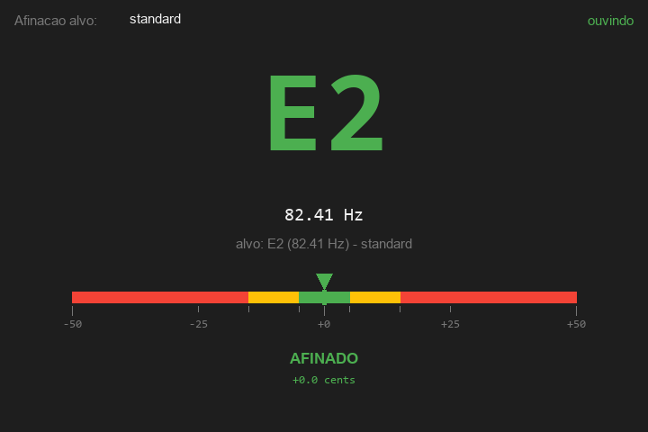
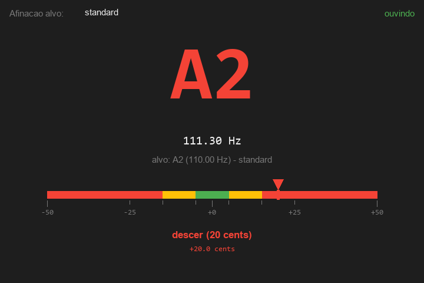

# 🎸 TANK-G-NOTA

Ferramentas em Python para **afinar** e **detectar nota / corda / casa** em tempo real usando o pedal multiefeitos **M-VAVE TANK-G** (ou qualquer interface de áudio) como entrada.

> Detecta o que você toca pelo áudio — **qual nota**, e com calibração, **qual corda e casa** específica no braço. Inclui um afinador visual.

---

## 🖼️ Interface

### Afinador visual (`tuner.py`)

| Afinado (verde) | Precisa ajustar (amarelo) |
|:---:|:---:|
|  |  |

Agulha de cents com faixas verde (±5¢) / amarelo (±15¢) / vermelho, nota em destaque e indicação de subir/descer.

### Detector de corda + casa (`fret_detector.py --classify`)

```
╔══════════════════════════════════════════════════════════╗
║  🎸  Corda 2 (B3 ) solta    → B3    conf  82.9%    ✓      ║
║       247.64 Hz      +5¢   afinação: standard            ║
╠══════════════════════════════════════════════════════════╣
║  Alternativas:                                            ║
║    Corda 3 (G3 ) casa  4  →   8.1%                        ║
║    Corda 4 (D3 ) casa  9  →   2.8%                        ║
╠══════════════════════════════════════════════════════════╣
║  [e] errou  [u] desfaz última correção  [q] sair         ║
╚══════════════════════════════════════════════════════════╝
```

> As imagens acima são ilustrações da interface renderizadas por [`docs/generate_mockup.py`](docs/generate_mockup.py), fiéis ao layout de `tuner.py`.

### 🎮 Jogo "Guitar Hero" com guitarra real (`game.py`)

Notas caem em 6 lanes (uma por corda). Quando uma nota cruza a linha de acerto, você **toca na guitarra de verdade** — o áudio é identificado e o acerto é julgado por timing (Perfect / Good / Miss), com pontuação e combo. Valida a **nota** (pitch); a corda/casa aparece como **dica**.

```bash
# tocar com a guitarra (TANK-G no device 2)
python game.py --device 2 --gain 40 --chart escala_mi

# testar sem guitarra (ESPAÇO = tocar a nota alvo no tempo certo)
python game.py --mock --chart escala_mi

# níveis de dificuldade (velocidade de queda + tolerância)
python game.py --device 2 --gain 40 --difficulty hard

# listar as músicas embutidas
python game.py --list
```

Controles: **ESPAÇO** (mock) toca a nota · **P** pausa · **R** reinicia · **ESC** sai.
Se o timing parecer adiantado/atrasado com a guitarra, ajuste `--audio-offset-ms`.

| Dificuldade | Velocidade | Janela Perfect / Good |
|-------------|-----------|------------------------|
| `easy` | mais lenta (2.8 s de queda) | 90 / 190 ms |
| `normal` (padrão) | 2.0 s de queda | 70 / 150 ms |
| `hard` | mais rápida (1.3 s de queda) | 55 / 110 ms |

---

## ✨ Funcionalidades principais

> 🚀 **Comece por aqui:** `python fret-detector/studio.py` abre o **TANK-G Studio** — um app único com menu que reúne tudo (dispositivo, afinador, treino, velocidade, monitor pelo fone) antes de cair numa música.

| Ferramenta | Arquivo | O que faz |
|-----------|---------|-----------|
| 🎛️ **TANK-G Studio (app único)** | `fret-detector/studio.py` | Hub com menu: identifica o TANK-G, afinador, treino (validar nota), velocidade, monitor pelo fone, e joga a música — tudo numa janela. |
| 🎯 **Afinador visual** | `fret-detector/tuner.py` | GUI com nota grande, agulha de cents e cores (verde/amarelo/vermelho). Suporta standard, Eb, Drop D/C/B/A. |
| 📡 **Detector de nota** | `fret-detector/fret_detector.py` | Detecta a nota tocada e lista **todas** as posições possíveis no braço. |
| 🧠 **Classificador corda+casa** | `fret-detector/fret_detector.py --classify` | Após calibrar, adivinha **a corda e casa exata** pelo timbre. Modo aprendizado embutido. |
| 🎙️ **Calibração** | `fret-detector/calibrate.py` | Aprende o timbre da SUA guitarra (~5 min) pra melhorar a detecção de corda. |
| 🎮 **Jogo (Guitar Hero)** | `fret-detector/game.py` | Notas caem na tela; você toca na guitarra de verdade e o acerto é julgado por timing. |
| 🔧 **Utilitários** | `list_devices.py`, `level_monitor.py` | Descobrir o ID do dispositivo e debugar nível de sinal. |

Documentação completa do pedal (painéis, efeitos, app, firmware) em [`tank-g/`](tank-g/).

---

## 📦 Requisitos

- **Python 3.10+**
- **numpy** e **sounddevice** (`pip install -r fret-detector/requirements.txt`)
- Uma entrada de áudio (o TANK-G via USB-C, ou qualquer interface/microfone)

> Testado no Windows 11 com o TANK-G como sound card USB.

---

## 🚀 Instalação

```bash
git clone https://github.com/FranciscoWallison/TANK-G-NOTA.git
cd TANK-G-NOTA/fret-detector
pip install -r requirements.txt
```

---

## 🎛️ App unificado: TANK-G Studio

A forma recomendada de usar — tudo numa janela só:

```bash
python studio.py                 # auto-detecta o TANK-G
python studio.py --device 2 --gain 40
```

No menu você tem:
- **Dispositivo** — identifica o TANK-G (entrada) e escolhe a saída (fone); nível de sinal ao vivo.
- **Afinador** — agulha de cents com cores.
- **Treino (validar nota)** — mostra a nota tocada + a dica de corda/casa.
- **Monitor (fone)** — liga/desliga; o app **reproduz a guitarra no seu fone do PC**.
- **Velocidade** — easy / normal / hard (vai pro jogo).
- **Jogar música** — entra no Guitar Hero com as configs escolhidas. **ESC** volta ao menu.

As escolhas ficam salvas em `settings.json`.

> As ferramentas abaixo também funcionam **standalone** (cada uma na sua janela), se preferir.

---

## 🎯 Uso (ferramentas standalone)

### 1. Descobrir o dispositivo de entrada

```bash
python list_devices.py
```
Anote o ID do seu TANK-G (aparece como `Microphone (USB-Audio)`).

### 2. Afinador visual

```bash
python tuner.py --device 2 --gain 20
```
- Toca uma corda → vê a nota, os cents e a agulha colorida.
- Troca a afinação alvo no dropdown (auto / standard / eb / drop-d…).
- `--smoothing off|low|medium|high` ajusta a estabilidade da leitura.

### 3. Detector de nota (sem calibração)

```bash
python fret_detector.py --device 2 --gain 20 --tuning standard
```
Mostra a nota + todas as casas onde ela poderia ser tocada.

### 4. Classificador de corda+casa (com calibração)

```bash
# 1) calibrar a sua guitarra (uma vez) — som limpo, palhetada firme
python calibrate.py --device 2 --gain 40 --tuning standard

# 2) usar
python fret_detector.py --device 2 --gain 40 --tuning standard --classify
```
No modo `--classify`:
- **`e`** — errou: desce pro próximo do ranking e **aprende** com você
- **`u`** — desfaz a última correção
- **`q`** — sair

> Dica: sinal do TANK-G via USB é fraco — use `--gain 20` a `60`. Veja o nível com `python level_monitor.py --device N`.

---

## 🗂️ Estrutura

```
TANK-G-NOTA/
├── fret-detector/          ← as ferramentas (código Python)
│   ├── studio.py           ← ⭐ APP UNIFICADO (menu: dispositivo/afinador/treino/jogo)
│   ├── screens.py          ← telas do hub (Menu, Device, Tuner, Train)
│   ├── ui.py               ← helpers de UI Pygame (Button, texto, paleta)
│   ├── tuner.py            ← afinador visual standalone (Tkinter)
│   ├── fret_detector.py    ← detector + classificador (YIN + correção de oitava)
│   ├── calibrate.py        ← calibração da guitarra
│   ├── features.py         ← extração de timbre (FFT)
│   ├── classifier.py       ← k-NN + aprendizado online
│   ├── game.py             ← jogo Guitar Hero (GameScreen Pygame)
│   ├── audio_engine.py     ← captura + pitch + onset + MONITOR (full-duplex)
│   ├── charts.py           ← músicas/sequências do jogo
│   ├── list_devices.py     ← lista dispositivos de áudio
│   ├── level_monitor.py    ← debug de nível de sinal
│   ├── requirements.txt
│   └── README.md           ← detalhes de cada ferramenta
│
└── tank-g/                 ← documentação do pedal M-VAVE TANK-G
    ├── README.md           ← índice
    ├── 01-especificacoes.md … 10-instalacao-local.md
```

---

## 🧠 Como funciona (resumo técnico)

| Etapa | Técnica |
|-------|---------|
| Captura de áudio | `sounddevice` (WASAPI/WDM-KS no Windows) |
| Detecção de pitch | **YIN** (numpy puro) com **correção de oitava** pra cordas graves |
| Nota | freq → MIDI → nome (A4 = 440 Hz) |
| Features de timbre | centroide espectral, rolloff, ZCR, inarmonicidade, razões de harmônicos |
| Classificação corda+casa | k-NN sobre features calibradas + **viés de ergonomia** (penaliza casas altas) |
| Aprendizado | correções do usuário salvas e reaplicadas (peso 2×) |

---

## ⚠️ Limitações

- **Monofônico** — uma nota por vez (acordes ainda não).
- **Corda exata é ambígua** no áudio mono — precisão de corda fica em ~75-85% após calibração (a **nota** é ~98%).
- Calibração é **por guitarra** — trocar de captador/cordas pede recalibrar.
- Sinal do TANK-G via USB é fraco; depende do `--gain`.

---

## 🛣️ Roadmap

- [x] Afinador visual
- [x] Detector de nota + posições
- [x] Classificador corda+casa com calibração e aprendizado
- [x] Correção de oitava + viés de ergonomia
- [x] **Jogo Guitar Hero** com detecção de ataque (onset) e julgamento de timing
- [x] **App unificado (TANK-G Studio)**: menu + dispositivo + afinador + treino + monitor pelo fone + jogo
- [ ] Trilha de áudio / metrônomo tocando junto no jogo
- [ ] Editor de chart / importar de MIDI ou tablatura
- [ ] Polifonia (acordes)
- [ ] GUI com diagrama do braço

---

## 📄 Licença

Código sob licença **MIT** — veja [LICENSE](LICENSE). Use, modifique e distribua livremente.

## 📜 Aviso

Este repositório contém **apenas código próprio e documentação**. Os aplicativos da M-VAVE (M-EFCS, atualizador de firmware) e manuais em PDF são **propriedade da Cuvave/M-VAVE** e **não** estão incluídos aqui (veja `.gitignore`). Baixe-os pelos canais oficiais: <https://www.m-vave.com>.

Projeto pessoal/educacional, sem afiliação com a M-VAVE.
